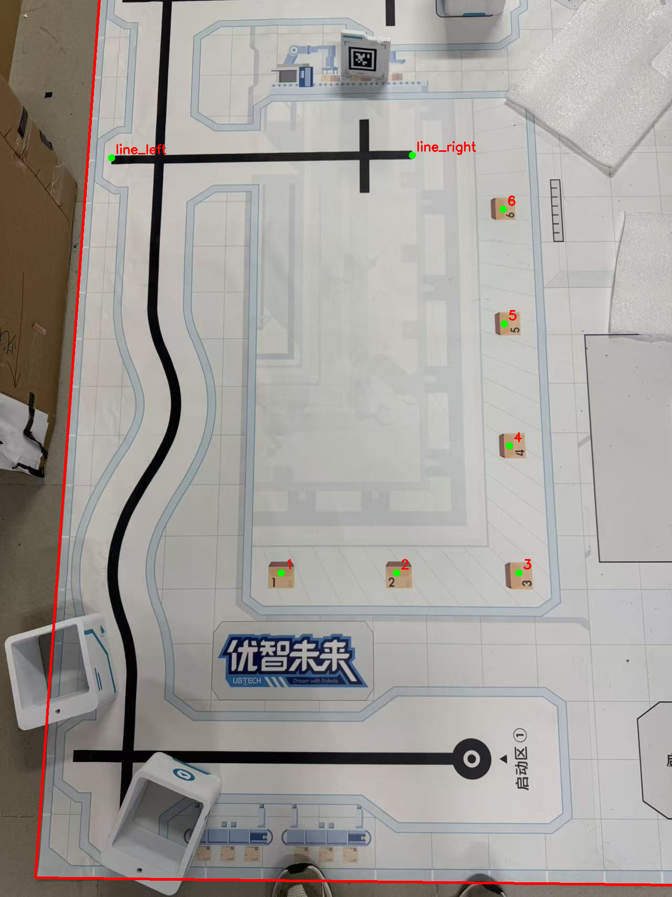

# 任务四地图坐标草案（尚未实车标定）

规则 PDF 第 6 页给出整张地图 `2400 × 1500 mm`，允许尺寸误差 ±3%；第 12 页给出色块棱长 `40 mm`。以下坐标采用现场照片的方向：照片左下角为 `(0, 0)`，`x` 向右至 150 cm，`y` 向照片上方至 240 cm。工程 `field_cm` 因此为 `[150, 240]`。

| 标记 | 估计中心或端点 `(x, y)` cm | 说明 |
| --- | --- | --- |
| 1 | (42.5, 53.3) | 色块位置中心 |
| 2 | (64.2, 53.3) | 色块位置中心 |
| 3 | (87.1, 53.3) | 色块位置中心 |
| 4 | (86.3, 77.7) | 色块位置中心 |
| 5 | (86.4, 102.6) | 色块位置中心 |
| 6 | (87.2, 127.5) | 色块位置中心 |
| 取货线段左端 | (5.1, 140.6) | 照片中黑色横线的左端 |
| 取货线段右端 | (68.8, 140.1) | 照片中黑色横线的右端 |

坐标来自规则图与现场照片的 SIFT 特征配准：304 个候选匹配，RANSAC 保留 142 个，匹配点的中位重投影误差约 0.66 像素。此数值只衡量两张图的局部对齐，不包括地图印刷误差、场地铺设形变、人工选点误差或机器人底盘里程误差。

`config.json` 中各编号的 `approach_cm` 暂设为距色块中心约 15 cm 的**候选车体中心**：1–3 号从照片上方朝下接近，4–6 号从左侧朝右接近。夹爪实际前伸距离、车体外廓、碰撞风险和放置姿态都尚未测量，全部保持 `calibrated: false`。任务四的机器人起点也尚未确定，`start_pose` 只是占位值。

在开启仓储运动前，需要将 UGOT 放到确定的取货区起点，核对车体中心与车头朝向；用实测直线位移和轮角关系修正运动；逐一检查 1–6 号的安全接近点、避障途经点和放置姿态；最后从每个放置点返回并视觉确认取货线段。照片推算值不能直接作为比赛动作通过依据。

## 现场照片定位与 10 cm 前进核对

三张现场俯视照片里的地图存在重复线条，单纯 SIFT 匹配即使显示较低重投影误差，也可能配准到错误区域。因此新增 [locate_photo.py](calibration/locate_photo.py)，支持用 1–6 号块的对应像素作为 `--anchor` 锁定正确区域。本次移动前照片中，机器人顶部圆环约在 `(57.0, 107.0)` cm、夹爪尖端约在 `(57.9, 78.6)` cm；前进 10 cm 后分别约在 `(55.9, 95.9)` cm 和 `(57.8, 68.4)` cm；再后退 10 cm，分别回到 `(56.5, 106.4)` cm 和 `(57.3, 78.6)` cm。照片估计前进约 10–11 cm、后退约 10.2–10.5 cm，回位残差约 0–1 cm。机器人面向照片下方，前进后靠近 2 号块，不应在那个位置继续直接向前测 30 或 50 cm。
